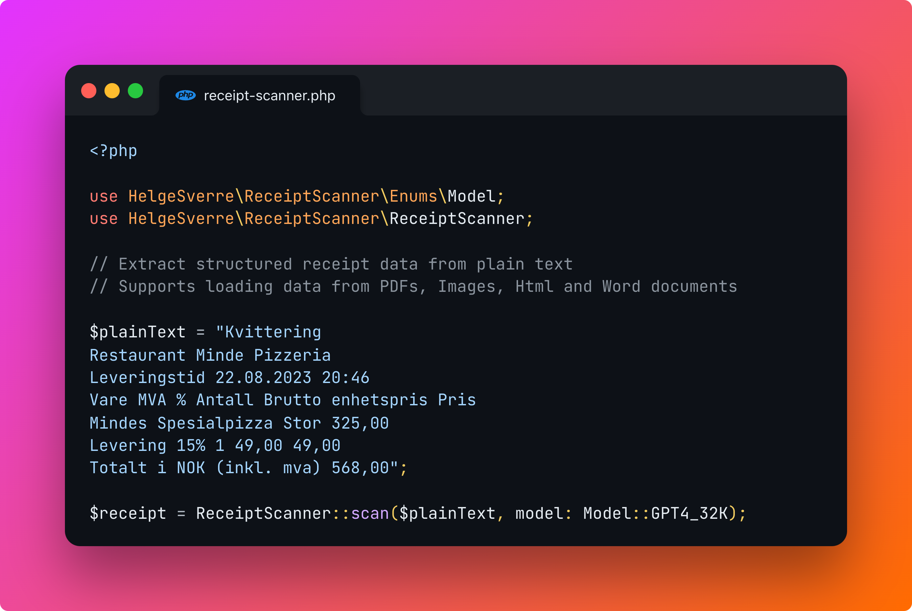

<p align="center"></p>

# AI-Powered Receipt and Invoice Scanner for Laravel


Easily extract structured receipt data from images, PDFs, and emails within your Laravel application using OpenAI.

## Features

- Light wrapper around OpenAI Chat and Completion endpoints.
- Accepts text as input and returns structured receipt information.
- Includes a well-tuned prompt for parsing receipts.
- Supports various input formats including Plain Text, PDF, Images, Word documents, and Web content.
- Integrates with [Textract](https://aws.amazon.com/textract/) for OCR functionality.

## Installation

Install the package via composer:

```bash
composer require helgesverre/receipt-scanner
```

Publish the config file:

```bash
php artisan vendor:publish --tag="receipt-scanner-config"
```

All the configuration options are documented in the configuration file.

Since this package uses the [OpenAI Laravel Package](https://github.com/openai-php/laravel), so you also need to publish
their config and add the `OPENAI_API_KEY` to your `.env` file:

```shell
php artisan vendor:publish --provider="OpenAI\Laravel\ServiceProvider"
```

```dotenv
OPENAI_API_KEY="your-key-here
```

## Usage

### Extracting receipt data from Plain Text

Plain text scanning is useful when you already have the textual representation of a receipt or invoice.

The example is from a Paddle.com receipt email, where I copied all the text in the email, and removed all the empty
lines.

```php
$text = <<<RECEIPT
Liseth Solutions AS
via software reseller Paddle.com
Thank you for your purchase!
Your full invoice is attached to this email.
Amount paid
Payment method
NOK 2,498.75
visa
ending in 4242
Test: SaaS Subscription - Pro Plan
September 22, 2023 11:04 am UTC - October 22, 2023 11:04 am UTC
NOK 1,999.00
QTY: 1
Subtotal
NOK 1,999.00
VAT
NOK 499.75
Amount paid*
NOK 2,498.75
*This payment will appear on your statement as: PADDLE.NET* EXAMPLEINC
NEED HELP?
Need help with your purchase? Please contact us on paddle.net.
logo
Paddle.com Market Ltd, Judd House, 18-29 Mora Street, London EC1V 8BT
© 2023 Paddle. All rights reserved.
RECEIPT;


ReceiptScanner::scan($text);
```

### Extracting data from other formats

```php
use HelgeSverre\ReceiptScanner\Facades\Text;

$textPlainText = Text::text(file_get_contents('./receipt.txt'));
$textPdf = Text::pdf(file_get_contents('./receipt.pdf'));
$textImageOcr = Text::textract(file_get_contents('./receipt.jpg'));
$textPdfOcr = Text::textractUsingS3Upload(file_get_contents('./receipt.pdf'));
$textWord = Text::word(file_get_contents('./receipt.doc'));
$textWeb = Text::web('https://example.com');
$textHtml = Text::html(file_get_contents('./receipt.html'));
```

After loading, you can pass the `TextContent` or the plain text (which can be retrieved by calling `->toString()`) into
the `ReceiptScanner::scan()` method.

```php
use HelgeSverre\ReceiptScanner\Facades\ReceiptScanner;

ReceiptScanner::scan($textPlainText)
ReceiptScanner::scan($textPdf)
ReceiptScanner::scan($textImageOcr)
ReceiptScanner::scan($textPdfOcr)
ReceiptScanner::scan($textWord)
ReceiptScanner::scan($textWeb)
ReceiptScanner::scan($textHtml)
```

## Receipt Data Model

The scanned receipt is parsed into a DTO which consists of a main `Receipt` class, which contains the receipt metadata,
and a `Merchant` dto, representing the seller on the receipt or invoice, and an array of `LineItem` DTOs holding each
individual line item.

- `HelgeSverre\ReceiptScanner\Data\Receipt`
- `HelgeSverre\ReceiptScanner\Data\Merchant`
- `HelgeSverre\ReceiptScanner\Data\LineItem`

The DTO has a `toArray()` method, which will result in a structure like this:

For flexibility, all fields are nullable.

```php
[
    "orderRef" => "string",
    "date" => "date",
    "taxAmount" => "number",
    "totalAmount" => "number",
    "currency" => "string",
    "merchant" => [
        "name" => "string",
        "vatId" => "string",
        "address" => "string",
    ],
    "lineItems" => [
        [
            "text" => "string",
            "sku" => "string",
            "qty" => "number",
            "price" => "number",
        ],
    ],
];
```

## Returning an Array instead of a DTO

If you prefer to work with an array instead of the built-in DTO, you can specify `asArray: true` when calling `scan()`

```php
use HelgeSverre\ReceiptScanner\Facades\ReceiptScanner;

ReceiptScanner::scan(
    $textPlainText
    asArray: true
)
```

## Specifying the model

To use a different model, you can specify the model name to use with the `model` named argument when calling
the `scan()` method.

```php
use HelgeSverre\ReceiptScanner\Facades\ReceiptScanner;

// With the ModelNames class
ReceiptScanner::scan($content, model: Model::GPT4_1106_PREVIEW)

// With a string
ReceiptScanner::scan($content, model: 'gpt-4-1106-preview')
```

## All parameters and what they do

**`$text` (TextContent|string)**

The input text from the receipt or invoice that needs to be parsed. It accepts either a `TextContent` object or a
string.

**`$model` (string)

This parameter specifies the OpenAI model used for the extraction process.

`HelgeSverre\ReceiptScanner\ModelNames` is a class containing constants for each model, provided for convenience.
However, you can also directly
use a string to specify the model if you prefer.

Different models have different speed/accuracy characteristics.

If you require high accuracy, use a GPT-4 model, if you need speed, use a GPT-3 model, if you need even more speed, use
the `gpt-3.5-turbo-instruct` model.

The default model is `ModelNames::TURBO_INSTRUCT`.

| `ModelNames` Constant           | Value                    |
|---------------------------------|--------------------------|
| `ModelNames::TURBO`             | `gpt-3.5-turbo`          |
| `ModelNames::TURBO_INSTRUCT`    | `gpt-3.5-turbo-instruct` |
| `ModelNames::TURBO_1106`        | `gpt-3.5-turbo-1106`     |
| `ModelNames::TURBO_16K`         | `gpt-3.5-turbo-16k`      |
| `ModelNames::TURBO_0613`        | `gpt-3.5-turbo-0613`     |
| `ModelNames::TURBO_16K_0613`    | `gpt-3.5-turbo-16k-0613` |
| `ModelNames::TURBO_0301`        | `gpt-3.5-turbo-0301`     |
| `ModelNames::GPT4`              | `gpt-4`                  |
| `ModelNames::GPT4_32K`          | `gpt-4-32k`              |
| `ModelNames::GPT4_32K_0613`     | `gpt-4-32k-0613`         |
| `ModelNames::GPT4_1106_PREVIEW` | `gpt-4-1106-preview`     |
| `ModelNames::GPT4_0314`         | `gpt-4-0314`             |
| `ModelNames::GPT4_32K_0314`     | `gpt-4-32k-0314`         |

**`$maxTokens` (int)**

The maximum number of tokens that the model will processes.
The default value is `2000`, adjusting this value may be necessary for very long text, but 2000 is "usually" fairly
good.

**`$temperature` (float)**

Controls the randomness/creativity of the model's output.

A higher value (e.g., 0.8) makes the output more random, which is usually not what we want in this scenario, I usually
go with 0.1 or 0.2, anything over 0.5 becomes useless. Defaults to `0.1`.

**`$template` (string)**

This parameter specifies the template used for the prompt.

The default template is `'receipt'`. You can create and use
additional templates by adding new blade files in the `resources/views/vendor/receipt-scanner/` directory and specifying
the file name (without extension) as the `$template` value (eg: `"minimal_invoice"`.

**`$asArray` (bool)**

If true, returns the response from the AI model as an array instead of as a DTO, useful if you need to modifythe default
DTO to have more/less fields or want to convert the response into your own DTO, defaults to `false`

### Example Usage:

```php
use HelgeSverre\ReceiptScanner\Facades\ReceiptScanner;

$parsedReceipt = ReceiptScanner::scan(
    text: $textInput,
    model: Model::TURBO_INSTRUCT,
    maxTokens: 500,
    temperature: 0.2,
    template: 'minimal_invoice',
    asArray: true,
);
```

### List of supported models

| Enum Value     | Model name             | Endpoint   |
|----------------|------------------------|------------|
| TURBO_INSTRUCT | gpt-3.5-turbo-instruct | Completion |
| TURBO_16K      | gpt-3.5-turbo-16k      | Chat       |
| TURBO          | gpt-3.5-turbo          | Chat       |
| GPT4           | gpt-4                  | Chat       |
| GPT4_32K       | gpt-4-32               | Chat       |

## OCR Configuration with AWS Textract

To use AWS Textract for extracting text from large images and multi-page PDFs,
the package needs to upload the file to S3 and pass the s3 object location along to the textract service.

So you need to configure your AWS Credentials in the `config/receipt-scanner.php` file as follows:

```dotenv
TEXTRACT_KEY="your-aws-access-key"
TEXTRACT_SECRET="your-aws-security"
TEXTRACT_REGION="your-textract-region"

# Can be omitted
TEXTRACT_VERSION="2018-06-27"
```

You also need to configure a seperate Textract disk where the files will be stored,
open your  `config/filesystems.php` configuration file and add the following:

```php
'textract' => [
    'driver' => 's3',
    'key' => env('TEXTRACT_KEY'),
    'secret' => env('TEXTRACT_SECRET'),
    'region' => env('TEXTRACT_REGION'),
    'bucket' => env('TEXTRACT_BUCKET'),
],
```

Ensure the `textract_disk` setting in `config/receipt-scanner.php` is the same as your disk name in
the `filesystems.php`
config, you can change it with the .env value `TEXTRACT_DISK`.

```php
return [
    "textract_disk" => env("TEXTRACT_DISK")
];
```

`.env`

```dotenv
TEXTRACT_DISK="uploads"
```

**Note**

Textract is not available in all regions:

> Q: In which AWS regions is Amazon Textract available?
> Amazon Textract is currently available in the US East (Northern Virginia), US East (Ohio), US West (Oregon), US West (
> N. California), AWS GovCloud (US-West), AWS GovCloud (US-East), Canada (Central), EU (Ireland), EU (London), EU (
> Frankfurt), EU (Paris), Asia Pacific (Singapore), Asia Pacific (Sydney), Asia Pacific (Seoul), and Asia Pacific (
> Mumbai)
> Regions.

See: https://aws.amazon.com/textract/faqs/

## Publishing Prompts

You may publish the prompt file that is used under the hood by running this command:

```bash
php artisan vendor:publish --tag="receipt-scanner-prompts"
```

This package simply uses blade files as prompts, the `{{ $context }}` variable will be replaced by the text you pass
to `ReceiptScanner::scan("text here")`.

## Adding prompts/templates

By default, the package uses the `receipt.blade.php` file as its prompt template, you may add additional templates by
simply creating a blade file in `resources/views/vendor/receipt-scanner/minimal_invoice.blade.php` and changing
the `$template` parameter when calling `scan()`

**Example prompt:**

```blade
Extract the following fields from the text below, output as JSON

date (as string in the  Y-m-d format)
total_amount (as float, do not include currency symbol) 
vendor_name (company name)

{{ $context }}

OUTPUT IN JSON
```

```php
use HelgeSverre\ReceiptScanner\Facades\ReceiptScanner;

$receipt = ReceiptScanner::scan(
    text: "Your invoice here",
    model:  Model::TURBO_INSTRUCT,
    template: 'minimal_invoice',
    asArray: true,
);
```

## License

This package is licensed under the MIT License. For more details, refer to the [License File](LICENSE.md).
